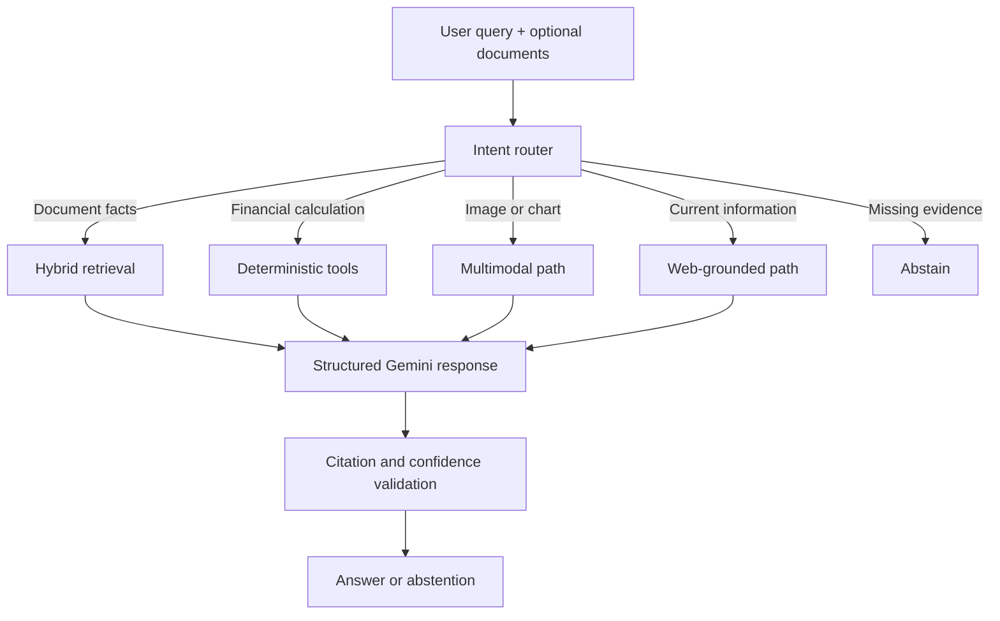
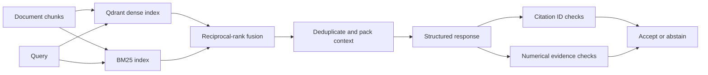

# FinSight AI

[](https://github.com/Shubhank2604/FinSight-AI/actions/workflows/ci.yml)
[](https://www.python.org/)

FinSight is an experimental financial analysis application that routes each request to document retrieval, deterministic finance tools, multimodal analysis, or an explicit abstention path. It combines Qdrant dense retrieval, BM25, reciprocal-rank fusion, structured Gemini output, and deterministic citation checks.

The repository includes credential-free evaluation for retrieval and response validation. It supports analysis and education; it does not execute trades or provide licensed financial advice.

## What is implemented

- PDF text and table ingestion with typed document chunks.
- Router-first execution across retrieval, calculation, multimodal, web-grounded, educational, and abstention paths.
- Dense retrieval through Qdrant, sparse retrieval through BM25, and reciprocal-rank fusion.
- Deterministic EMI, portfolio-growth, tax, and options calculations.
- Structured model responses with claim-level citation IDs.
- Validation for missing citations, unknown sources, required tool use, missing inputs, and numerical citation mismatches.
- Offline tests and versioned evaluation reports that run without Gemini credentials.

## Architecture



The router decides which evidence and tools are required before generation. Calculation routes use deterministic functions for numerical work; the model explains results but does not replace the calculation.

### Retrieval and validation



The validation layer checks grounding mechanics and deterministic numerical consistency. It does **not** prove that every natural-language claim is semantically entailed by its source.

## Reproducible evaluation

### Retrieval baseline

The versioned retrieval benchmark contains 18 labeled queries over 18 synthetic finance chunks. It exercises the production Qdrant, BM25, and fusion paths using deterministic local embeddings.

| Mode | Precision@3 | Recall@3 | MRR@3 | nDCG@3 |
| --- | ---: | ---: | ---: | ---: |
| Dense local hash | 0.315 | 0.944 | 0.861 | 0.883 |
| BM25 | 0.333 | 1.000 | 0.972 | 0.979 |
| Hybrid RRF | 0.315 | 0.944 | 0.889 | 0.903 |

BM25 wins on this small, deliberately lexical corpus. That result is retained because the benchmark is intended to expose trade-offs, not assert that hybrid retrieval is always superior.

### Citation and abstention baseline

The versioned validation benchmark contains 11 structured-answer cases.

| Metric | Result |
| --- | ---: |
| Citation precision | 0.692 |
| Citation recall | 0.600 |
| Abstention precision | 1.000 |
| Abstention recall | 0.857 |
| Accept/abstain accuracy | 0.909 |

Missing and unknown citations are rejected, as is a citation with conflicting numerical evidence. A wrong but valid citation for a nonnumeric claim still passes. This known failure is documented rather than presented as semantic verification.

See [the evaluation methodology](docs/evaluation.md) for dataset construction, metric definitions, per-query failures, and limitations.

## Run locally

Requirements: Python 3.11+.

```bash
python -m venv .venv
source .venv/bin/activate                 # macOS/Linux
# .\.venv\Scripts\Activate.ps1          # Windows PowerShell
python -m pip install -r requirements.txt
cp .env.example .env                      # macOS/Linux
# Copy-Item .env.example .env             # Windows PowerShell
streamlit run app.py
```

Gemini-backed application paths require `GEMINI_API_KEY`. Tests and evaluation use deterministic local embeddings and do not require external credentials.

Index local documents:

```bash
python index_uploads.py \
  --folder data/uploads/originals \
  --embedding-provider local_hash
```

## Test and evaluate

```bash
python -m pytest -q

python eval_retrieval.py \
  --top-k 3 \
  --min-hybrid-recall 0.90 \
  --output evals/results/latest.json

python eval_citations.py \
  --min-abstention-recall 0.85 \
  --output evals/results/citation_baseline.json
```

GitHub Actions runs all three checks on every pull request to `master`.

## Design decisions

| Decision | Reason | Trade-off |
| --- | --- | --- |
| Route before generation | Makes required evidence and tools explicit | Rule-based routing needs maintained intent coverage |
| Keep deterministic calculators outside the LLM | Prevents the model from performing authoritative arithmetic | Supported calculations must be implemented separately |
| Combine BM25 and dense retrieval | Preserves exact financial terms while allowing semantic matches | Fusion adds complexity and can underperform BM25 on lexical corpora |
| Validate before returning an answer | Rejects missing citations, inputs, and numerical mismatches | Current checks cannot establish general semantic entailment |
| Use synthetic evaluation data | Keeps CI deterministic, redistributable, and credential-free | Results do not establish performance on arbitrary real documents |

## Repository map

```text
app.py                  Streamlit application and request orchestration
router/                 Intent and execution-path selection
ingestion/              PDF extraction and typed chunking
retrieval/              Qdrant, BM25, RRF, and context selection
tools/                  Deterministic finance calculators
verifier/               Citation, input, confidence, and number checks
evaluation/             Benchmark runners and metric implementations
evals/                  Versioned datasets and result artifacts
docs/evaluation.md      Methodology, failures, and limitations
```

## Evaluation scope and safety boundary

FinSight separates deterministic regression tests from provider-dependent behavior so CI remains reproducible and credential-free.

| Verified in this repository | Outside the current benchmark |
| --- | --- |
| Retrieval ranking over 18 labeled finance queries | Accuracy across arbitrary financial documents |
| Citation linkage and abstention over 11 structured cases | General nonnumeric claim/source entailment |
| Numerical consistency between claims and cited evidence | End-to-end correctness of generated financial advice |
| Router, tool, retrieval, and verifier behavior without network access | Gemini and web-grounded behavior across provider/model changes |

The synthetic corpus and local hash vectors provide a stable regression baseline for the retrieval implementation. They are deliberately reported separately from Gemini-backed semantic retrieval so model changes cannot silently alter the CI result.

FinSight is decision-support software. Calculations are performed by deterministic tools, while generated explanations and external financial information should be independently reviewed before they inform a real financial decision.

## License

MIT
