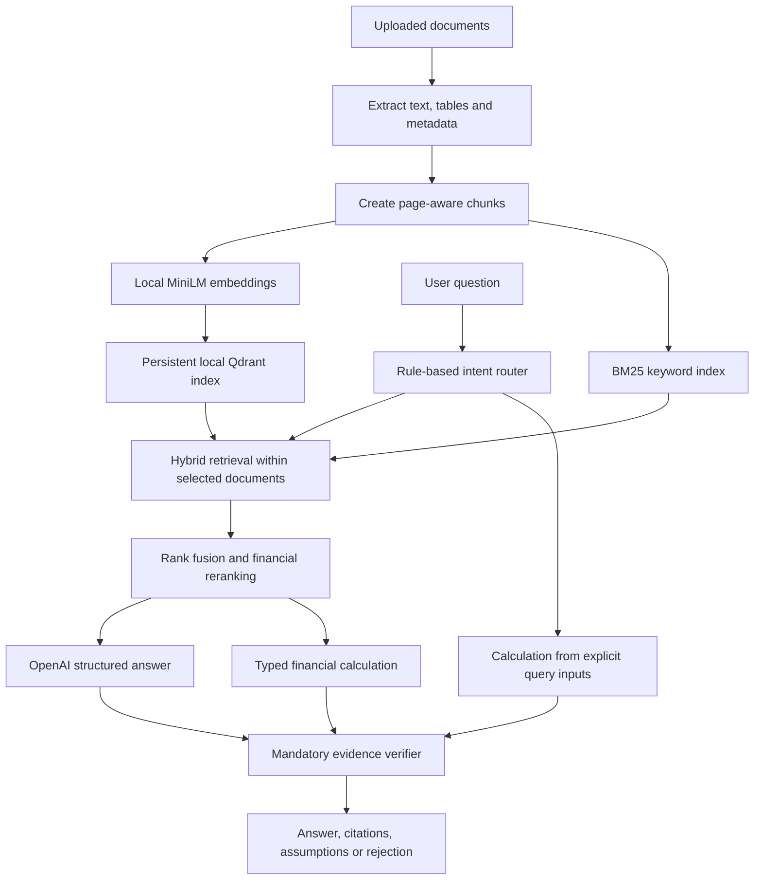

# FinSight AI

FinSight is a financial document research assistant with explicit evidence
contracts and deterministic calculations. Select documents, ask an independent
question, and inspect citations or calculation inputs. The local core runs on CPU.

Use `master` for the supported application. The repair and cleanup work was
merged through [PR #7](https://github.com/Shubhank2604/FinSight-AI/pull/7).
Historical reports retain the source revisions on which they were measured.

## Features

- Upload PDFs or PNG/JPG/JPEG images, up to 20 MB per file. Successful uploads are
  indexed automatically; failed uploads have an explicit retry control.
- Ask across active documents, select a narrower scope, or add more files later.
- Use local MiniLM semantic embeddings plus BM25, rank fusion and financial
  reranking automatically. No search-method selector is required.
- Receive structured OpenAI answers checked against source evidence. The optional
  OpenAI explanation switch has been removed.
- Ask supported financial calculations in the same question box. The standalone
  Calculators tab has been removed; deterministic tools remain available.
- Inspect citations, source pages, calculation inputs, provenance and assumptions.
- Delete a specific document's indexed evidence and managed original copy.

## Architecture

The application separates Streamlit presentation from a Python orchestration layer.
Uploads become page-aware chunks in a local Qdrant index. A rule-based router
selects retrieval, education or typed financial tools; the verifier checks the
result before display. Automatic OpenAI generation sits behind that same verifier.
See the [architecture](docs/architecture.md) for contracts and recovery behavior.

The diagram shows document research and calculation paths. A separate educational
route can generate answers without uploaded-document evidence; web and vision
remain experimental.


```mermaid
flowchart TD
    A[Uploaded documents] --> B[Extract text, tables and metadata]
    B --> C[Create page-aware chunks]
    C --> D[Local MiniLM embeddings]
    D --> E[Persistent local Qdrant index]
    C --> F[BM25 keyword index]

    Q[User question] --> R[Rule-based intent router]
    R --> H[Hybrid retrieval within selected documents]
    E --> H
    F --> H
    H --> S[Rank fusion and financial reranking]

    S --> L[OpenAI structured answer]
    S --> T[Typed financial calculation]
    R --> U[Calculation from explicit query inputs]

    L --> V[Mandatory evidence verifier]
    T --> V
    U --> V
    V --> O[Answer, citations, assumptions or rejection]
```

| Component | Responsibility |
| --- | --- |
| [App](app.py) and [uploads](uploads.py) | Streamlit UI, automatic indexing, document selection and deletion |
| [Ingestion](ingestion/extractor.py) | Page-aware text, tables and metadata using pdfplumber and PyMuPDF |
| [MiniLM encoder](minilm_embeddings.py) | Pinned CPU embeddings and complete token-window coverage |
| [Hybrid retriever](retrieval/hybrid.py) | Qdrant, BM25, fusion, reranking and index recovery |
| [Router](router/intent_router.py) and [orchestration](orchestration.py) | Rule-based routing and application flow |
| [Financial evidence](financial_evidence.py) and [tools](tools/) | Bound financial records and deterministic calculations |
| [OpenAI adapter](openai_client.py) and [verifier](verifier/verifi.py) | Structured generation and mandatory evidence checks |
| [Evaluation](evaluation/) | Independent outcome scoring, quality gates and budgeted live checks |

### Ingestion, evidence and calculations

Supported verified output consists of canonical financial facts binding company,
metric, year, currency and normalized value; faithful source excerpts; or
validated deterministic tool results. Arbitrary narrative entailment and arbitrary
PDF layouts are outside that contract. Unsupported or conflicting inputs cause
clarification or abstention. Confidence diagnostics are binary gates, not probabilities.

PDF ingestion preserves source/page/company/period/currency/unit metadata. EMI,
portfolio projection, current ratio, debt/equity, net/operating margin and
metric-specific year-over-year growth use typed inputs and recorded provenance.
Complete query inputs override document scenarios; partial overrides clarify.
Split loan fields must belong to the same document and compatible company/period/
currency. Conflicts remain visible even when another chunk contains a complete loan.

Text chunks contain up to 800 whitespace words with 12% overlap; these limits are
not model-token counts. Tables retain rows as metadata. Supported canonical
metrics include revenue, net income, operating income, current assets, current
liabilities, debt and equity, with recognized aliases and unit scales.

| Calculation | Behavior |
| --- | --- |
| EMI | Monthly payment, interest totals and amortization preview |
| Portfolio projection | Initial balance, monthly contributions, annual step-up, contribution timing and nominal/effective annual rate conventions |
| Current ratio | Current assets / current liabilities |
| Debt-to-equity | Debt / equity |
| Net margin | Net income / revenue × 100 |
| Operating margin | Operating income / revenue × 100 |
| Year-over-year growth | Percentage change in one supported metric across consecutive reporting years |

Calculation answers use tools directly and do not require an OpenAI call. Zero
denominators and incompatible currencies or reporting periods are rejected.

### Retrieval and generation

The generation provider is the official OpenAI Responses SDK with configurable
validated model profiles; the default is `gpt-5.4-mini-2026-03-17`. Generation
is automatic in the app. Document questions use BM25 plus dense retrieval, reciprocal
rank fusion, financial context reranking, and verified OpenAI answers. Semantic
embeddings use local CPU `sentence-transformers/all-MiniLM-L6-v2` with 384 dimensions.
OpenAI is called only for final answer generation after context preparation.
BM25 and financial reranking are local. Credential-free hash vectors remain an
explicit regression baseline. Collection identities include the pinned model
revision, vector dimensions, token-window pooling, and ingestion version.
The v3 ingestion change requires re-indexing; preserve existing uploads and `.env`.

MiniLM is pinned to revision `1110a243fdf4706b3f48f1d95db1a4f5529b4d41`.
Long chunks use complete 256-token windows with token-count-weighted pooling rather
than silently truncating their tails. Repeated query embeddings are cached in
memory. The normal app and indexing CLI reject cloud embedding configurations;
legacy OpenAI/Gemini embedding adapters remain for explicit historical evaluations.

Retrieval takes up to 24 dense and 24 BM25 candidates, combines rankings with
reciprocal rank fusion (`k = 60`), and selects up to eight context chunks after
financial reranking. The reranker considers lexical overlap, table relevance,
reporting periods and metric aliases. It is a deterministic heuristic, not a
trained cross-encoder.

Streamlit shows source evidence, interpreted inputs, authoritative results,
assumptions and optional diagnostics. USD is the default calculation currency.
Portfolio timing and rate conventions can be specified in questions. Tax is disabled until reviewed
rule packs exist. Web and vision are experimental. Queries are independent;
displayed history is not conversation memory. Index recovery uses a journal and
Qdrant as authority; duplicate-content aliases are rejected with the existing name.
A rebuild validates each batch and preserves compatible evidence on failure,
but is not a globally atomic transaction.

## Setup

Python 3.13 is supported. Latest local validation on Windows Python 3.13.9 passed
237 unit tests, `pip check` and locked dependency resolution. The lockfile contains
92 dependency pins; Torch and a GPU are not required. Measurement provenance and
historical Linux CI status are recorded in [verification](docs/verification.md).

```powershell
python -m venv .venv
.\.venv\Scripts\Activate.ps1
python -m pip install -r requirements.lock
python -m pip check
# Only if you do not already have a private configuration:
Copy-Item .env.example .env
python -m streamlit run app.py
```

For an existing Windows installation, run from the repository directory:

```powershell
.\.venv\Scripts\python.exe -m streamlit run app.py
```

Open **http://localhost:8510**.

On Linux/macOS use `source .venv/bin/activate` and `cp`.
Set `OPENAI_API_KEY` privately for final answer generation. Upload indexing and
semantic retrieval use MiniLM locally and need no OpenAI key. The first model
download needs network access and caches pinned ONNX weights under ignored
`data/models/minilm`; subsequent embedding inference works offline. The app
uses OpenAI automatically only when an answer requires generation. Configuration defaults and supported model profiles
are in [.env.example](.env.example) and the [provider runbook](docs/openai-migration.md).

Documents are not sent to Hugging Face for embedding. Selected evidence is sent
to OpenAI when generating a document answer. `.env`, uploads, indexes and model
caches are ignored by Git.

## Upload and index documents

1. Upload files in the sidebar. Files are indexed automatically; each is limited to 20 MB.
2. Ask questions across your uploaded documents, or narrow **Active documents**.
   Hybrid retrieval and reranking run automatically. Inspect source pages and inputs.
   Include a document cue such as "in the report": the current rule-based router
   does not force every question through retrieval merely because files are selected.
3. Ask calculations in the same question box, for example current ratio in a report
   or EMI for an explicit loan scenario. Supported arithmetic uses deterministic tools.
4. Add more files at any time. Choose a specific file under **Delete a document**
   and click **Delete file** to remove its indexed evidence and managed upload copy.
   Same-name files with different contents are kept as separate documents.

Example questions for [Cedar.pdf](evals/fixtures/Cedar.pdf):

- "What is revenue for Cedar in the report for 2025?"
- "Calculate current ratio for Cedar in the report for 2025."
- "Calculate revenue year-over-year growth for Cedar in the report for 2025."
- "Calculate EMI on a USD 500000 loan at 8% annual interest for 20 years."

Successful uploads are not re-embedded on every Streamlit rerun. Failed uploads
need **Retry failed uploads**. Original copies are not automatically restored into
a new collection when the embedding identity changes.

For a walkthrough, use `evals/fixtures/Cedar.pdf`, `Elm.pdf`, and
`evals/repair_v3/Mint-2024-CFO.pdf` with the [demo queries](docs/demo.md).
`python demo.py` remains credential-free. Images
can be indexed, but verified visual answers remain unsupported.

For batch indexing, stop the app first because the local index has one owner:

```powershell
python index_uploads.py --folder evals/fixtures --embedding-provider minilm
```

Original uploads remain under `data/uploads/originals` until that file is deleted
in the app. CLI index-only deletion preserves originals. Provider changes create separate index identities and require
re-indexing. Preserve the old index when changing providers.

## Reproduce the evidence

```powershell
python -m pytest -q -p no:cacheprovider --basetemp=.test-tmp/check-unique
python eval_retrieval.py --min-hybrid-recall 0.90 --output .test-tmp/retrieval.json
python eval_citations.py --min-abstention-recall 0.85 --output .test-tmp/citations.json
python -m evaluation.router --quality-gate --output .test-tmp/router.json
python -m evaluation.application --quality-gate --output .test-tmp/application.json.gz
python -m evaluation.replay --output .test-tmp/historical-rescore.json.gz
python demo.py --output .test-tmp/demo.json
```

Demo and rescore commands default to ignored `.test-tmp` reports. Retained results
are historical evidence, with their measured source revision recorded separately.
Use a new pytest temporary directory for each run. Paid checks require credentials
and an explicit authorized cap. Share a persisted ledger between sequential runs;
do not reset it to bypass the cap. A rerun repeats requests rather than resuming a
checkpoint. Paid runs are excluded from CI.

```powershell
python -m evaluation.application --embedding-provider minilm --output .test-tmp/semantic.json.gz --quality-gate
python -m evaluation.application --live --embedding-provider minilm --mode hybrid --repeats 3 --budget-usd 2 --output .test-tmp/live.json.gz --quality-gate
python -m evaluation.provider_checks --live --budget-usd 2 --output .test-tmp/provider.json
```

The default application evaluator and legacy retrieval gate use hash embeddings.
The explicit `minilm` command tests actual local semantic inference. The
[CI workflow](.github/workflows/ci.yml) uses hash embeddings on Python 3.13;
actual MiniLM verification was performed locally. Both paid runners default to
the same `.test-tmp/openai-repair-budget.json` ledger. Preserve that ledger across
runs. Reports retain completed requests and explicitly mark missing requests and
repeats if a run stops early.

The new frozen [v3 dataset](evals/repair_v3/README.md) has 12 documents and 130
questions: ten synthetic issuers and two real government CFO excerpts from one
issuer. There are 84 development and 46 internal held-out questions. Labels are
agent-authored and not independently human-reviewed. The independent v3 scorer
checks complete fact tuples, full labeled tool inputs/results, exact rejection
statuses and the displayed answer. Mutations reject swapped company/year/metric,
wrong values/units, tiny ratio errors and extra unsupported assertions.

The real-document subset contains only two positive factual questions. The
held-out split is internal, not a blind external benchmark.

## Measured results

### Current local MiniLM implementation — 2026-10-06

| Check | Recorded result |
| --- | --- |
| Unit tests | 237 passed |
| Actual MiniLM application evaluation, generation disabled | 390/390 outcomes: 130 questions × BM25, dense and hybrid modes |
| Router benchmark | 120/120 correct |
| Citation/abstention guard | 11/11 correct decisions; abstention precision and recall 1.0 |
| Cached offline proof | Indexing and hybrid search passed with `HF_HUB_OFFLINE=1`, no OpenAI key and OpenAI client creation blocked |
| Live UI smoke | Automatic indexing, a cited revenue answer, current ratio 2.0 and specific-file deletion passed |
| Dependency checks | `pip check` and locked dependency resolution passed |

Each retrieval mode correctly accepted 40 factual answers and 68 calculations
and rejected/clarified 22 cases. Answerable coverage was 100%; overall answer
coverage was 83.08% because some questions intentionally require rejection.
Accepted numerical/tool and citation-reference checks passed. These are internal
contract checks, not unrestricted semantic-accuracy measurements.

Raw source/page-labeled retrieval metrics at `k = 3`:

| Mode | Precision@3 | Recall@3 | Hit rate@3 | MRR | nDCG@3 |
| --- | ---: | ---: | ---: | ---: | ---: |
| BM25 | 0.450617 | 0.995370 | 1.0 | 0.981481 | 0.976637 |
| MiniLM dense | 0.447531 | 0.990741 | 1.0 | 0.930556 | 0.944280 |
| Hybrid | 0.444444 | 0.986111 | 1.0 | 0.950617 | 0.953210 |

BM25 leads several ranking metrics on this dataset; the measurements do not
establish an optimal hybrid reranker. Relevant-page text/table duplicates count
as relevant, and final eight-chunk context coverage differs from raw top-three ranking.

Cached local latency, with generation disabled:

| Mode | Retrieval p50 / p95 | Local total p50 / p95 |
| --- | ---: | ---: |
| BM25 | 0.40 / 0.59 ms | 3.17 / 5.56 ms |
| MiniLM dense | 2.49 / 3.87 ms | 7.82 / 11.32 ms |
| Hybrid | 2.31 / 4.29 ms | 5.40 / 13.11 ms |

Query embeddings were prepared before these timings. Upload parsing, model
download, uncached embedding and live generation latency are excluded. These
small-corpus measurements are not a production throughput benchmark.

The current live smoke used **one OpenAI generation request and zero OpenAI
embedding requests**. It returned Cedar's 2025 revenue of USD 120 million with a
page citation; the current-ratio calculation used no provider call. Generation
used 1,190 input and 119 output tokens and took approximately 3.47 seconds. The
accounted estimate was $0.001428, bringing the persisted evaluation ledger to
**$0.3601935 of the authorized $2 cap**. Invoice cost is unknown.

The full MiniLM offline run made zero OpenAI calls. **A full repeated live
evaluation of the current MiniLM configuration has not been recorded.** Current
artifacts are local, ignored files under `.test-tmp/app-runtime`, including
`minilm-semantic-final.json.gz`, `minilm-offline-proof.json` and
`live-minilm-ui.json`. See [verification](docs/verification.md) for source digests
and provenance. No remote CI result was measured for the MiniLM revision.

### Historical full live evaluation

Clean source `02d6ea4` used OpenAI embeddings, hybrid retrieval and OpenAI generation:

- **381/390 correct outcomes (97.69%)** across 130 questions × three repeats.
- 223 tests passed; router 120/120; offline application 390/390.
- 120 generation calls and eight embedding requests in the final application run.
- All 204 calculations passed; no expected-rejection case was accepted (0/66).
- Eight false abstentions and one valid net-sales alias failed strict canonical
  metric scoring; these failures remain counted.
- Semantic comparison and three acceptance probes passed. Remote Ubuntu
  CI [passed on that measured revision](https://github.com/Shubhank2604/FinSight-AI/actions/runs/37265605624).

The [historical live report](evals/repair_v3/results/application-live.json.gz) is
retained. Its 97.69% result is not the measured live accuracy of the current MiniLM
configuration. Paid repair checks at that stage accounted for an estimated
$0.3558943, including prior attempts; the later ledger total is reported above.

Historical 354/360 live correctness (98.33%) used weaker labels and hash retrieval;
it is not the current repaired-system accuracy. Retained raw reports are losslessly
compressed with original hashes and duplicate mappings in the [evidence index](evals/results/evidence-index.json).

## Current limitations

- Verified output covers supported bound financial facts, faithful excerpts and
  deterministic tools. Arbitrary narrative entailment and arbitrary PDF layouts
  are outside the contract.
- Images can be indexed, but reliable OCR and verified visual answers are not
  supported. Web and vision remain experimental; web access is disabled by default.
- Document routing requires explicit document wording. Educational responses are
  not verified against uploaded evidence, and displayed history is not memory.
- Conflict detection depends on retrieved context; contradictory evidence outside
  the selected chunks can be missed.
- Tax is disabled until reviewed rule packs exist. Library-only options pricing
  and EMI prepayment functions are not fully exposed through the question interface.
- The local index has one owner. Authentication, multi-tenant isolation,
  distributed serving and production load behavior have not been established.
- Journal recovery supports interrupted operations, but a rebuild is not a
  globally atomic transaction across all batches.

## Further documentation

See [verification](docs/verification.md), [evaluation methodology](docs/evaluation.md),
[implementation checklist](docs/implementation-checklist.md), [architecture](docs/architecture.md),
[demo](docs/demo.md), and [interview walkthrough and Q&A](docs/interview-preparation.md).

Historical sections describe earlier configurations; use the latest verification
entry and current code for the MiniLM implementation.
