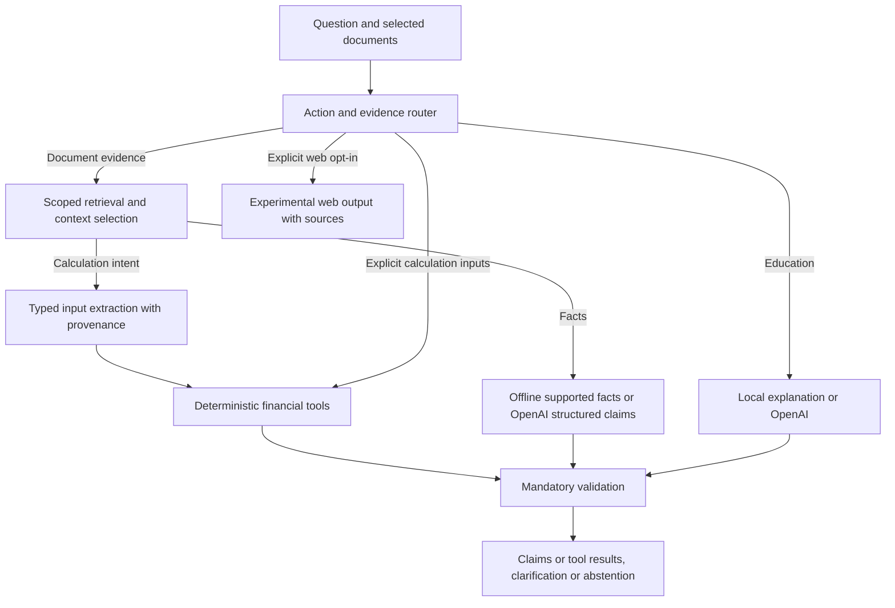

# FinSight AI

[](https://github.com/Shubhank2604/FinSight-AI/actions/workflows/ci.yml)

FinSight is a financial document research assistant with explicit evidence contracts and deterministic calculations. Select documents, ask an independent question, inspect its citations or input provenance, and receive an answer, clarification or abstention. The local core runs on CPU; no GPU or large local model is required.

The generation provider is OpenAI Responses (`gpt-5.4-mini-2026-03-17`). Local hash embeddings keep the default workflow credential-free. Optional OpenAI semantic embeddings use `text-embedding-3-small` with 768 dimensions and a separate collection. Legacy Gemini embeddings remain optional; Gemini generation has been removed.

## Verified behavior

- PDF text/table ingestion preserves company, period, currency, units and page metadata.
- Typed EMI and portfolio inputs recognize reordered questions, reject missing/conflicting/nonfinite fields, and preserve source provenance.
- Document calculations support EMI, revenue year-over-year growth, net/operating margin, current ratio and debt-to-equity with formulas and referenced inputs.
- Scoped BM25, dense and reciprocal-rank-fusion retrieval filters documents before ranking. Collection identities isolate provider/model/dimensions/ingestion configuration.
- Mandatory tool/evidence gates run before acceptance. Validated claims or tool results are the displayed answer; unsupported generated numbers and invalid references cause abstention.
- Persistent index recovery covers interrupted batches, stale catalogs, replacement, deletion, restart and rebuild; storage locks produce actionable errors.
- Streamlit shows readable citations, selected documents, calculators, inputs/results/assumptions, failure reasons and optional diagnostics. Queries are independent; previous turns are display history.

## Architecture


```mermaid
flowchart TD
    Q[Question and selected documents] --> R[Action and evidence router]
    R -->|Document evidence| H[Scoped retrieval and context selection]
    H -->|Calculation intent| E[Typed input extraction with provenance]
    E --> T[Deterministic financial tools]
    H -->|Facts| G[Offline supported facts or OpenAI structured claims]
    R -->|Explicit calculation inputs| T
    R -->|Education| A[Local explanation or OpenAI]
    T --> V[Mandatory validation]
    G --> V
    A --> V
    V --> O[Claims or tool results, clarification or abstention]
    R -->|Explicit web opt-in| W[Experimental web output with sources]
```

The model cannot replace authoritative calculation values. Citation and numerical consistency are narrower than general semantic entailment; this system does not prove every natural-language claim follows from its sources. See [architecture](docs/architecture.md) and [evaluation methodology](docs/evaluation.md).

## Setup and demonstration

Verified locally: CPython 3.13.9, Windows x64. CI targets Python 3.13 Linux; remote CI execution is not claimed for the local branch. The resolved lock targets Python 3.13.

```powershell
python -m venv .venv
.\.venv\Scripts\Activate.ps1
python -m pip install -r requirements.lock
python -m pip check
# Only when creating a new local configuration:
Copy-Item .env.example .env
streamlit run app.py
```

On macOS/Linux, activate with `source .venv/bin/activate` and copy using `cp`. Preserve an existing `.env`. Set `OPENAI_API_KEY` privately for generation. Offline retrieval and deterministic calculations need no key. The UI defaults to offline generation.

Use the redistributable PDFs in `evals/fixtures`. Run `python demo.py` for five reproducible scenarios: document fact, document EMI, period comparison, conflicting-evidence abstention and an injected provider timeout. See [demo instructions](docs/demo.md).

```powershell
python index_uploads.py --folder evals/fixtures --embedding-provider local_hash
# Optional semantic collection; documents must be re-indexed:
python index_uploads.py --folder evals/fixtures --embedding-provider openai
```

For semantic retrieval in the UI, explicitly set `EMBEDDING_PROVIDER=openai` and re-ingest selected documents. This creates a separate compatible collection; old hash/Gemini indexes remain available for rollback. Generation-model changes do not change embedding identity. See [provider configuration and migration](docs/openai-migration.md) and [dependencies](docs/dependencies.md).

## Reproducible evidence

The dataset contains 12 agent-authored CC0 PDF fixtures and 120 questions: eight companies/80 development cases, four companies/40 held-out cases frozen before tuning. Router evaluation contains 100 labeled cases. Labels are not independently human-reviewed; repeated synthetic templates limit generalization.

| Evaluation | Measured result | Scope |
|---|---|---|
| Clean locked environment tests | 148 passed; dependency consistency checks pass | Python 3.13.9 Windows |
| Offline application, BM25/hash dense/hybrid | 360/360 correct; full answerable coverage; zero unsupported acceptance | 120 synthetic questions in each mode, deterministic answers |
| OpenAI generation with hash hybrid retrieval | 354/360 correct (98.33%); 98.08% answerable coverage; zero unsupported acceptance | Three repeats of the same 120 questions; 138 actual schema-valid API responses |
| OpenAI held-out application subset | 120/120 correct across three repeats | 40 synthetic held-out questions, including deterministic/calculation/abstention routes |
| Live acceptance probes | 3/3 pass | Grounded answer, structured extraction, unchanged calculation explanation |
| Router | 100/100 correct | Controlled rule-based routing cases |
| Vision/web | Synthetic image probes and explicit web request returned output | Experimental adapter evidence; excluded from verified accuracy |

Live application correctness by repeat was 96.67%, 100% and 98.33%. Six answerable requests abstained; raw outputs and reasons are retained. Accepted numerical/citation checks and final evidence coverage were 100% under the controlled labels. API schema validity is separate from financial acceptance. Application requests are not all API calls: tools and some abstentions bypass generation. Token usage is measured; invoice cost is unknown.

Reports: [repeated live application](evals/results/application-openai-live-verified.json), [acceptance probes](evals/results/provider-openai-final.json), [experimental probes](evals/results/experimental-openai-web-verified.json). Genuine semantic comparison is recorded separately in `evals/results/application-openai-semantic.json`; hash vectors are not semantic.

Historical evidence remains identifiable: the original 18-query/18-chunk retrieval baseline achieved Recall@3 BM25 1.000 and hash/hybrid 0.944; the 11-case citation baseline had abstention recall 0.8571. Historical Gemini live/semantic reports include quota-limited partial runs and must not be relabeled as OpenAI successes. [Methodology and historical tables](docs/evaluation.md).

## Verification commands

```powershell
New-Item -ItemType Directory -Force .test-tmp
python -m pytest -q -p no:cacheprovider --basetemp=.test-tmp/check-unique
python eval_retrieval.py --min-hybrid-recall 0.90 --output evals/results/retrieval-check.json
python eval_citations.py --min-abstention-recall 0.85 --output evals/results/citation-check.json
python -m evaluation.router --quality-gate --output evals/results/router-check.json
python -m evaluation.application --quality-gate --output evals/results/application-check.json
```

Use a fresh pytest temporary directory each time in restricted Windows environments. GitHub Actions enforces unit, historical retrieval/citation, router and application correctness/coverage gates. Abstaining on everything fails the application gate. Paid/stochastic checks are separate:

```powershell
python -m evaluation.provider_checks --live --output evals/results/provider-check.json
python -m evaluation.application --live --mode hybrid --repeats 3 --output evals/results/application-live-check.json
python -m evaluation.application --embedding-provider openai --quality-gate --output evals/results/semantic-check.json
```

The last command makes real embedding requests but uses deterministic answers; combine `--embedding-provider openai --live` to measure generation with semantic retrieval. Each completed live application request is checkpointed. Missing requests and repeat scores are explicit; incomplete runs exit nonzero.

## Limits and interview preparation

Web requires `OPENAI_WEB_ENABLED=true`, the UI web checkbox and generation selection. Source annotations and retrieval times are preserved, but publication date, latest-source coverage and claim entailment are not generally verified. It returns experimental status. Vision is available through adapter probes and stable PDF-page rendering; ordinary UI visual questions remain unsupported experimental.

Extraction supports conservative labeled records and tables; arbitrary filings, complex multi-level tables, cross-company calculations and general prose entailment need further evaluation. Real tax estimates require a reviewed jurisdiction/year rule pack; the old demo pack is excluded. Independent review and representative real documents remain outstanding for broad accuracy claims.

[Completed checklist and qualified requirements](docs/implementation-checklist.md), [beginner architecture](docs/architecture.md), [two-minute walkthrough, interview Q&A and claim/evidence table](docs/interview-preparation.md). Resume bullets are not finalized. No unrestricted accuracy, production certification or remote CI/deployment success is claimed.

## Repository map

`app.py` / `ui_calculators.py`: interface; `orchestration.py`: request workflow; `calculation_inputs.py` / `financial_evidence.py`: typed inputs and supported facts; `openai_client.py`: generation adapter; `embeddings.py`: isolated embedding providers; `ingestion/`, `retrieval/`, `router/`, `tools/`, `verifier/`: application components; `evaluation/` / `evals/`: datasets, runners and evidence.

## License

MIT; generated evaluation fixtures are CC0 as recorded in their manifest.
