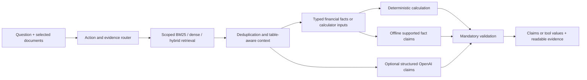

# Architecture, explained from the user request

FinSight has five distinct jobs. The interface collects a question and an explicit set of documents. The router decides the action and where its evidence must come from. Retrieval locates candidate chunks. Typed extraction decides whether the required inputs exist. The application either runs a calculator or constructs factual claims, validates them, and displays their supporting evidence.

For example, “Calculate current ratio for 2025 in the report” requires a document calculation. Retrieval is filtered by selected source names inside Qdrant before ranking. Extraction finds current assets and liabilities with the same company, year and currency. It normalizes million/billion scales, records chunk/page/unit references, and rejects contradictory values. The calculator divides assets by liabilities. The UI displays that exact result and the input provenance. A language model never supplies the authoritative arithmetic.

General education uses local templates by default or OpenAI Structured Outputs when generation is selected and does not need uploaded documents merely because some exist. “Current ratio” and “current assets” are terminology, whereas “current stock price” needs explicit external access. Each request is independent; the displayed history is not conversation memory.

`orchestration.py` handles requests without Streamlit. `calculation_inputs.py` defines supported fields and query parsing. `financial_evidence.py` handles financial quantities and labeled metric records. `tools/research.py` defines document formulas. `verifier/verifi.py` applies mandatory gates, then renders authoritative claims/tools. `app.py` only manages user interaction, resources and presentation; the reachable calculator forms are in `ui_calculators.py`.

## Persistence and recovery

The index identity includes provider, model (or hash algorithm), dimensions and ingestion version. Different identities use different collections and collection-specific catalogs. Opening locked local storage returns an actionable failure; it never creates an unrelated empty memory index.

Qdrant payloads are authoritative. Startup rebuilds the catalog from points, which repairs both missing/corrupt catalogs and catalogs claiming nonexistent points. Each write uses an atomic JSON replacement with a flush/fsync. An ingestion journal records new and obsolete chunk IDs. A failure during embedding rolls back new points; after all upserts succeed, the journal marks the replacement ready and old points are deleted. Startup completes or rolls back an interrupted transaction. Deletion uses the same recovery path. A rebuild re-embeds in place, so a provider failure preserves existing compatible points. One application process owns a local index; a shared multi-process deployment would need a Qdrant server and coordinated transactions.

## Validation boundary

Mandatory gates cannot be overridden by confidence: required inputs, evidence, matching tools, tool success, structured output and known references must exist. Numerical claims check currency, scale, rates, sign, metric, direction, period and explicitly detectable entity associations. Full evidence stays available even when display snippets are shortened. Claims are the authoritative factual output; unchecked narrative is discarded. Tool output is rendered directly.

This is deliberately conservative and is not a general semantic entailment proof. Verified prose is restricted to complete faithful excerpts or canonical bound financial facts. Unsupported assertions such as insolvency are rejected; historical reports preserve the former failure. Complex narrative paraphrases, unlabeled units, unstated periods, restatements and arbitrary tables may require clarification or a reviewed extension of the extraction contract. No score is a calibrated probability of correctness.

Query calculation defaults are USD for an unspecified currency, a nominal annual rate divided by twelve (explicit monthly rates are multiplied by twelve with provenance), and end-of-month contributions. CAD/AUD specificity takes precedence over the generic dollar symbol. The portfolio form/parser also supports effective annual rates, beginning-of-month contributions, initial balances and annual contribution step-up. Explicit complete query scenarios override document scenarios; partial overrides require clarification. Research ratios use document values and matching periods. Unsupported requested features are rejected rather than omitted.

## Experimental capabilities

`render_pdf_pages` renders selected PDF pages so vector charts are available as images. Image bytes get stable evidence identifiers before provider submission; missing images fail explicitly. A filename descriptor is never numerical evidence. Web adapters preserve source metadata, retrieval timestamps and OpenAI URL citation annotations and consulted sources; retrieval time is not publication time and does not establish freshness. These adapters are excluded from verified core claims until representative live validation is complete.

## LLM provider boundary

`openai_client.py` contains the official OpenAI SDK Responses calls, strict Pydantic-compatible schemas, image inputs, web-search annotations and safe failure handling. `llm_prompts.py` keeps prompt versions explicit. Only supported profiles are accepted; there is no Gemini generation fallback. Every response records requested and actual model, response ID, attempts, latency, token usage and schema outcome. Document claims still pass the verifier before display; calculator routes still display deterministic tool values directly. Web output is explicitly experimental and bypasses no verified-answer gate.

`embeddings.py` isolates hash, optional OpenAI and legacy Gemini embedding spaces independently. Generation model changes do not change collection identities or re-embed documents. See the [provider runbook](openai-migration.md) for configuration and re-indexing instructions, and [verification](verification.md) for measured results.

## Repair contracts

Currency and scale are inherited independently; explicit local scale takes precedence. Periods are identified by reporting context, so $2025 remains money. Financial claims bind entity, metric, period, currency and normalized value. A passed mandatory-check indicator is binary, not calibrated confidence. Growth carries its requested metric through routing, extraction, calculation and final validation.

Document EMI may join compatible labeled inputs across selected chunks of one document. Original chunk spans remain available. Complete explicit query inputs override document values; partial overrides clarify. Multiple calculation requests clarify. Duplicate content under another filename is rejected with the existing source name; same-filename new content replaces transactionally. Invalid recovery journals are preserved and reported. Rebuild validates each batch before upsert; previous compatible points remain searchable, but rebuild is not an all-batches atomic transaction.

The v3 ingestion identity creates a separate collection: re-index after upgrading. Whitespace chunk lengths are not model tokenizer counts. General PDF extraction, ambiguous restatements, and arbitrary prose entailment remain unsupported.

Numeric document answers also bind the returned fact set to the query-scoped
entity, metrics and periods. A true but unrequested fact is insufficient.
Independent scoring uses stricter canonical metric names than the production
synonym parser: a valid net-sales alias can pass support but fail that format
contract. This measured mismatch remains explicit; the scorer was not relaxed.
